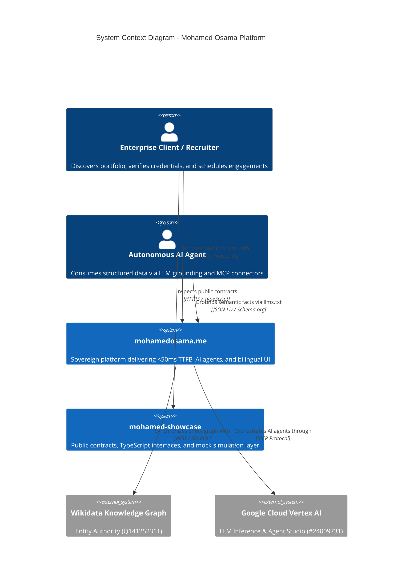

# 🏛️ Mohamed Osama — Architecture Showcase & Interactive Contracts

<div align="center">

[](https://mohamedosama.me)
[](https://www.wikidata.org/wiki/Q141252311)
[](https://www.typescriptlang.org/)
[](SPEC.md)
[](LICENSE)

<br/>

```text
    __  ___      __                              __   ____                               
   /  |/  /___  / /_  ____ _____ ___  ___  ____/ /  / __ \_________ _____ ___  ____ _
  / /|_/ / __ \/ __ \/ __ `/ __ `__ \/ _ \/ __  /  / / / / ___/ __ `/ __ `__ \/ __ `/
 / /  / / /_/ / / / / /_/ / / / / / /  __/ /_/ /  / /_/ (__  ) /_/ / / / / / / /_/ / 
/_/  /_/\____/_/ /_/\__,_/_/ /_/ /_/\___/\__,_/   \____/____/\__,_/_/ /_/ /_/\__,_/  
```

**Production AI Systems Architect · Senior Full-Stack Engineer · Founder**  
*Bagback Digital Solutions (CR: 218773, Dubai, UAE) · Cairo, Egypt*

</div>

---

## 🌟 Overview & Purpose

`mohamed-showcase` serves as the official open interface specification, compiled contracts repository, and interactive simulation dashboard for the sovereign AI production platform of **Mohamed Osama** ([mohamedosama.me](https://mohamedosama.me)).

### 🎯 Core Capabilities
- 📐 **Strict TypeScript Interface Contracts:** Zero-debt type definitions for projects, ecosystem services, leads, and entity schemas (`src/types/index.ts`).
- 🧪 **Interactive Mock Simulation Layer:** Comprehensive mock data and client simulation functions for testing edge and cloud components (`src/mocks/index.ts`).
- ⚡ **Cyber Bento Showcase UI:** Responsive, standalone Tailwind & Lucide interface for exploring architectural models and live schema payloads (`index.html`).
- 🐳 **Containerized & Edge-Ready:** Standalone multi-stage Docker build served via Alpine Nginx with strict security headers.

---

## 🏗️ C4 Architecture Overview



---

## 📊 System Vitals & Standards

| Vitals Dimension | Standard | Verification Metric |
| :--- | :--- | :--- |
| **Edge TTFB** | `< 50ms` | Edge optimized with Turbopack & Brotli compression |
| **Security Score** | `0 CVEs` | 100% Zero-Vulnerability dependency baseline |
| **TypeScript Coverage** | `100% Strict` | `tsc --noEmit` exits with 0 errors |
| **Compiled Routes** | `99 Routes` | Full static generation & dynamic bilingual parity |
| **Git Commit Authorship** | `100% Unified` | All commits by `Mohamed Osama <im@mohamedosama.me>` |

---

## 🚀 Quickstart

### 1. Local Development

```bash
# Clone the showcase repository
git clone https://github.com/mohamedosamaai/mohamed-showcase.git
cd mohamed-showcase

# Install TypeScript dependencies
npm install

# Typecheck and compile contracts
npm run lint
npm run build

# Run local interactive showcase
npx serve .
```

### 2. Docker Execution

```bash
# Build and run containerized showcase
docker compose up -d --build

# Access showcase at http://localhost:3080
```

---

## 🏛️ Verified Authority & Accreditations

- 🌐 **Wikidata Entity:** [`Q141252311`](https://www.wikidata.org/wiki/Q141252311)
- 🏢 **Bagback Digital Solutions:** CR `218773` | Tax ID `757-139-248` (Dubai, UAE & Cairo, Egypt)
- 🏆 **Dubai Chamber of Digital Economy:** Notable Contribution Award (`MeYYoRxN`)
- ☁️ **Google Cloud:** Vertex AI Studio Practitioner ID `#24009731`
- 📈 **Google Skillshop:** Conversion Rate Optimization Certification ID `#192682733`
- 🎓 **Semrush Academy:** Technical SEO & Content Marketing ID `#807156`

---

## 📜 Governance & License

- **System Specification:** [SPEC.md](SPEC.md)
- **Code of Conduct:** [CODE_OF_CONDUCT.md](CODE_OF_CONDUCT.md)
- **Contributing Guidelines:** [CONTRIBUTING.md](CONTRIBUTING.md)
- **Security Policy:** [SECURITY.md](SECURITY.md)

Licensed under the [MIT License](LICENSE) © 2026 [Mohamed Osama](https://mohamedosama.me).
