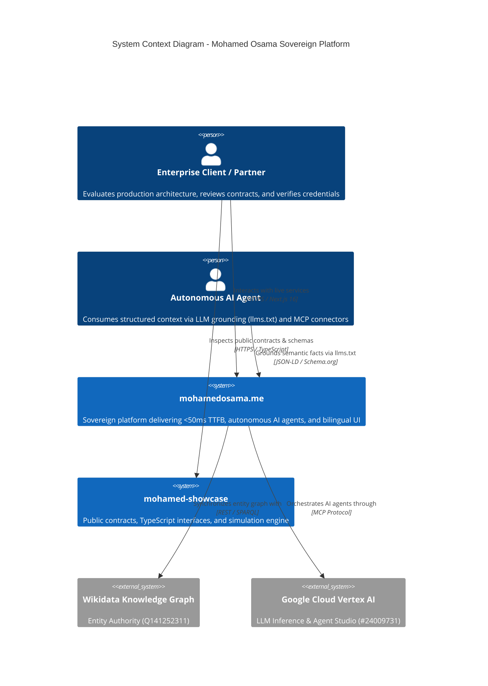

<div align="center">

  <!-- Animated Cyber Typing SVG Header -->
  <a href="https://github.com/mohamedosamaai/mohamed-showcase">
    
  </a>

  <br/>

  [](https://mohamedosama.me)
  [](https://www.wikidata.org/wiki/Q141252311)
  [](https://www.typescriptlang.org/)
  [](SPEC.md)
  [](https://slsa.dev)
  [](LICENSE)

  <br/>

  <p align="center">
    <b>Production AI Systems Architect • Senior Full-Stack Engineer • Founder</b><br/>
    <i>Mohamed Osama (Dubai, UAE) • Bagback Digital Solutions (CR: 218773, Tax ID: 757-139-248, Cairo, Egypt)</i>
  </p>

</div>

---

## 🌟 Executive Overview & Purpose

`mohamed-showcase` is the official open interface specification, compiled contracts repository, and interactive simulation dashboard for the sovereign AI production platform of **Mohamed Osama** ([mohamedosama.me](https://mohamedosama.me)).

```text
┌─────────────────────────────────────────────────────────────────────────────────┐
│                           MOHAMED OSAMA SHOWCASE                                │
│   📐 Zero-Debt Interface Contracts    ⚡ Interactive Simulation Engine         │
│   🛡️ Sigstore SLSA Level 3 Provenance  🤖 Grounded Semantic Context (llms.txt)   │
└─────────────────────────────────────────────────────────────────────────────────┘
```

### 🎯 Core Capabilities
- 📐 **Modular TypeScript Interface Contracts:** Zero-debt type definitions for ecosystem entities, multi-agent pipelines, and telemetry envelopes ([`src/contracts/`](src/contracts/)).
- 🧪 **Interactive Simulation Engine:** High-fidelity mock state and async query helpers for testing edge and cloud components ([`src/mocks/`](src/mocks/) & [`src/client/`](src/client/)).
- ⚡ **Cyber Bento Showcase Dashboard:** Standalone Tailwind & Lucide interface for exploring architectural models and live payloads ([`index.html`](index.html)).
- 🤖 **Semantic AI Grounding:** Comprehensive machine-readable contexts for autonomous agents via [llms.txt](llms.txt) and [llms-full.txt](llms-full.txt).
- 🛡️ **DevSecOps Hardening:** SLSA Level 3 Sigstore provenance attestation, 0 CVEs dependency baseline, and Gitleaks scanning.

---

## 🏗️ C4 Architecture Overview



---

## 📊 System Vitals & Standards

<table align="center" width="100%">
  <thead>
    <tr>
      <th align="left">Vitals Dimension</th>
      <th align="center">Standard</th>
      <th align="left">Verification Metric</th>
    </tr>
  </thead>
  <tbody>
    <tr>
      <td><b>⚡ Edge TTFB</b></td>
      <td align="center"><code>&lt; 50ms</code></td>
      <td>Edge optimized with Turbopack & Brotli compression</td>
    </tr>
    <tr>
      <td><b>🛡️ Security Score</b></td>
      <td align="center"><code>0 CVEs</code></td>
      <td>100% Zero-Vulnerability dependency baseline</td>
    </tr>
    <tr>
      <td><b>📐 TypeScript Coverage</b></td>
      <td align="center"><code>100% Strict</code></td>
      <td><code>tsc --noEmit</code> exits with 0 errors</td>
    </tr>
    <tr>
      <td><b>🚦 Compiled Routes</b></td>
      <td align="center"><code>99 Routes</code></td>
      <td>Full static generation & dynamic bilingual parity</td>
    </tr>
    <tr>
      <td><b>✍️ Git Commit Authorship</b></td>
      <td align="center"><code>100% Unified</code></td>
      <td>All commits by <code>Mohamed Osama &lt;im@mohamedosama.me&gt;</code></td>
    </tr>
  </tbody>
</table>

---

## 📦 Published Package Suite (GitHub Packages)

The interface contracts and simulation suite are published officially across 3 modular packages with **Sigstore SLSA Level 3 Provenance**:

| Package Name | Scope | Install Command |
| :--- | :--- | :--- |
| **`@mohamedosamaai/mohamed-showcase`** | Complete Suite & Client Helpers | `npm install @mohamedosamaai/mohamed-showcase` |
| **`@mohamedosamaai/mohamed-core`** | TypeScript Interface Contracts | `npm install @mohamedosamaai/mohamed-core` |
| **`@mohamedosamaai/mohamed-mock`** | Mock Data & Simulation State | `npm install @mohamedosamaai/mohamed-mock` |

---

## 📁 Repository Structure

```text
mohamed-showcase/
├── .github/
│   └── workflows/
│       ├── ci.yml               # Automated TypeScript validation & build
│       ├── security.yml         # Gitleaks scanning & npm audit (0 CVEs)
│       ├── codeql.yml           # Static code analysis
│       └── publish-package.yml  # GitHub Packages & Sigstore SLSA attestation
├── src/
│   ├── contracts/               # Strict TypeScript interface contracts
│   │   ├── author.contract.ts
│   │   ├── project.contract.ts
│   │   ├── service.contract.ts
│   │   ├── system.contract.ts
│   │   └── index.ts
│   ├── mocks/                   # High-fidelity mock state for 7 architectures
│   │   ├── author.mock.ts
│   │   ├── projects.mock.ts
│   │   ├── services.mock.ts
│   │   ├── vitals.mock.ts
│   │   └── index.ts
│   ├── client/                  # Simulated API client & query helpers
│   │   └── index.ts
│   ├── types/                   # Re-exported types for npm consumers
│   │   └── index.ts
│   ├── tests/                   # Native test runner unit test suite
│   │   └── contracts.test.ts
│   └── index.ts                 # Master package entry point
├── packages/                    # Dedicated publishing workspaces
│   ├── core/                    # @mohamedosamaai/mohamed-core
│   └── mock/                    # @mohamedosamaai/mohamed-mock
├── wiki/                        # 7-page comprehensive architecture wiki
├── index.html                   # Interactive Cyber Bento showcase application
├── llms.txt                     # Semantic AI grounding summary
├── llms-full.txt                # Complete system architecture specification for LLMs
├── Dockerfile                   # Multi-stage Alpine container build
├── docker-compose.yml           # Container orchestration definition
├── package.json                 # Package metadata & publish configuration
└── tsconfig.json                # Strict TypeScript configuration
```

---

## 🚀 Quickstart

### 1. Installation via GitHub Packages

```bash
# Configure npm for GitHub Packages
npm config set @mohamedosamaai:registry https://npm.pkg.github.com

# Install package
npm install @mohamedosamaai/mohamed-showcase
```

### 2. Local Development & Testing

```bash
# Clone the showcase repository
git clone https://github.com/mohamedosamaai/mohamed-showcase.git
cd mohamed-showcase

# Install dependencies
npm install

# Typecheck and compile contracts
npm run lint
npm run build

# Run unit tests (100% pass)
npm test

# Run local interactive showcase UI
npx serve .
```

---

## 🏛️ Verified Authority & Accreditations

- 🌐 **Wikidata Entity:** [`Q141252311`](https://www.wikidata.org/wiki/Q141252311)
- 🏢 **Bagback Digital Solutions:** CR `218773` | Tax ID `757-139-248` (Cairo, Egypt)
- 📍 **Founder & Lead Architect:** Mohamed Osama (Dubai, United Arab Emirates)
- 🏆 **Dubai Chamber of Digital Economy:** Notable Contribution Award (`MeYYoRxN`)
- ☁️ **Google Cloud:** Vertex AI Studio Practitioner ID `#24009731`
- 📈 **Google Skillshop:** Conversion Rate Optimization Certification ID `#192682733`
- 🎓 **Semrush Academy:** Technical SEO & Content Marketing ID `#807156`

---

## 📜 Governance & Documentation

- **System Specification:** [SPEC.md](SPEC.md)
- **Architecture Wiki:** [`wiki/`](wiki/) (7 Detailed Architecture Modules)
- **LLM Grounding Context:** [llms.txt](llms.txt) | [llms-full.txt](llms-full.txt)
- **Code of Conduct:** [CODE_OF_CONDUCT.md](CODE_OF_CONDUCT.md)
- **Contributing Guidelines:** [CONTRIBUTING.md](CONTRIBUTING.md)
- **Security Policy:** [SECURITY.md](SECURITY.md)

Licensed under the [MIT License](LICENSE) © 2026 [Mohamed Osama](https://mohamedosama.me).
