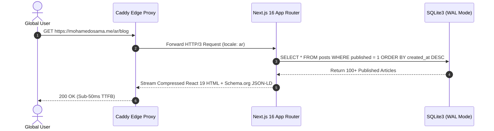
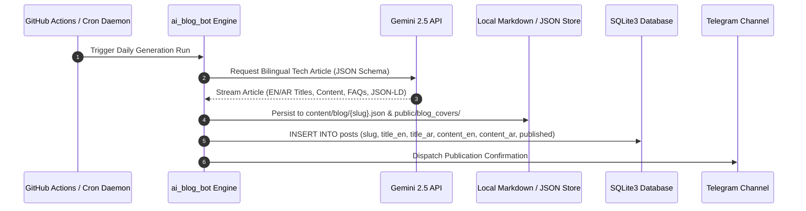

# 🔄 Data Flow & Request Lifecycle

This document outlines the synchronous and asynchronous data pipelines within the platform.

---

## 1. Request Lifecycle & Rendering Pipeline

---

## 2. Autonomous Daily AI Blog Publishing Engine

